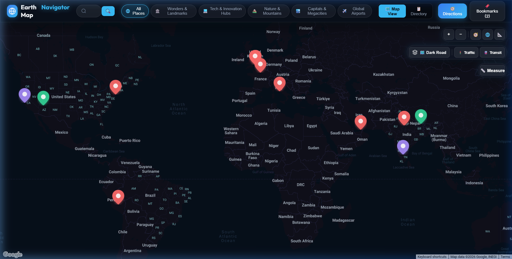
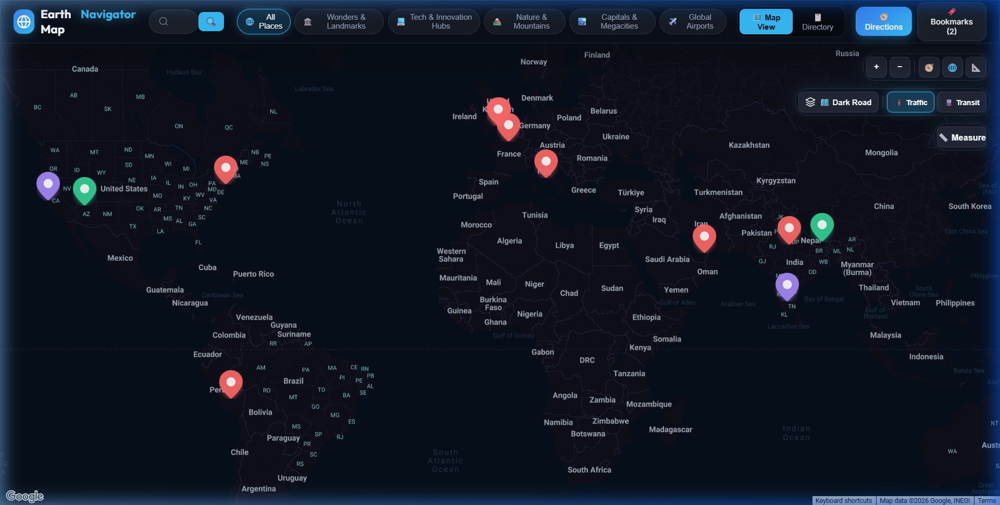
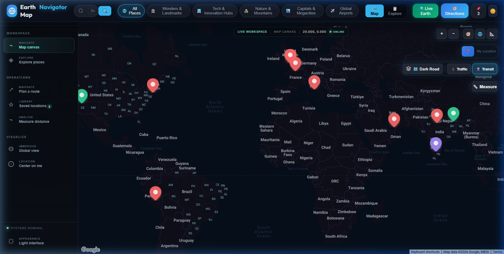
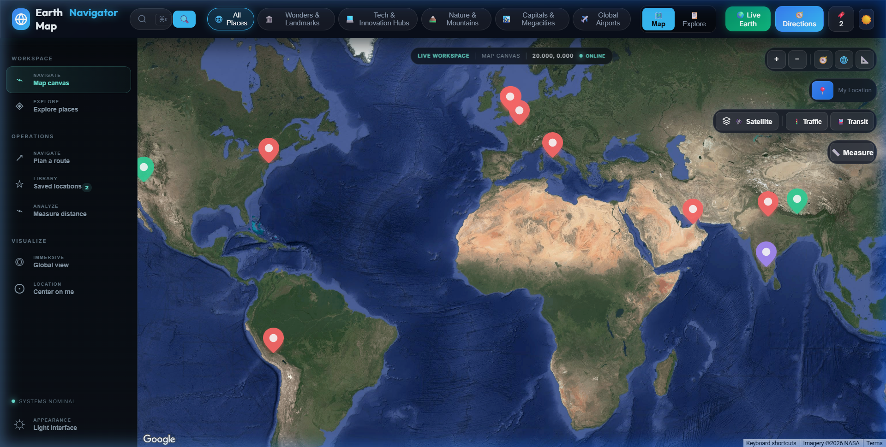
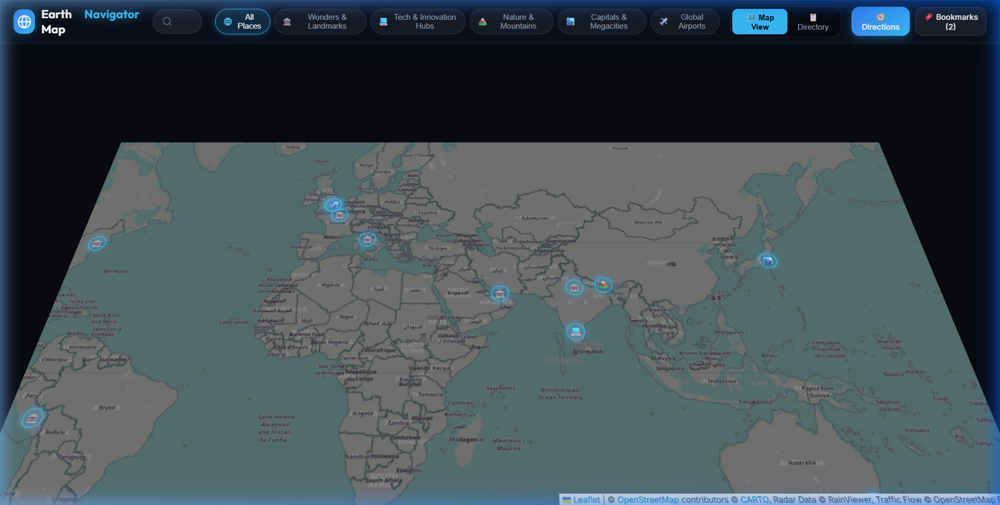
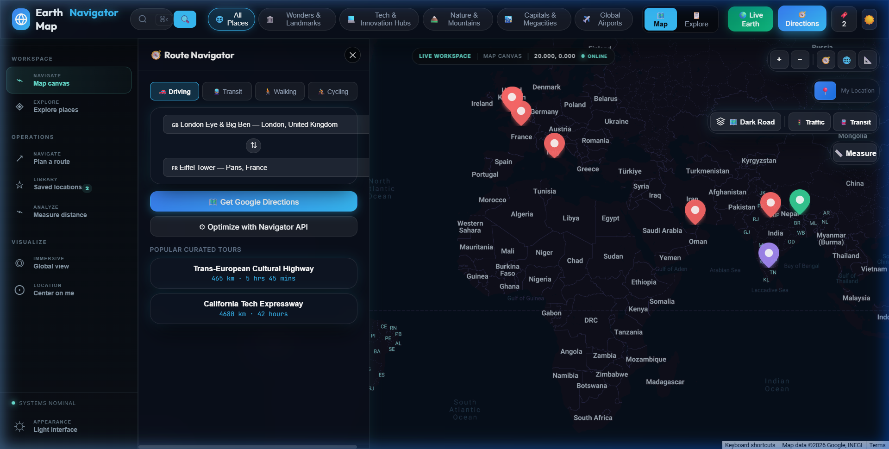
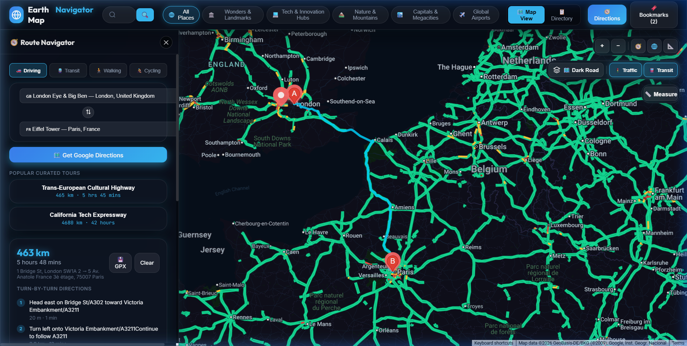
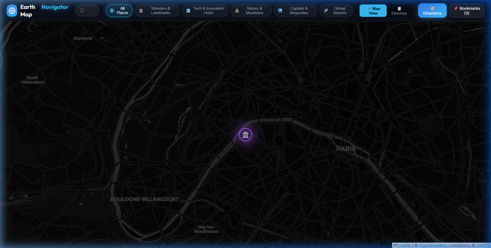
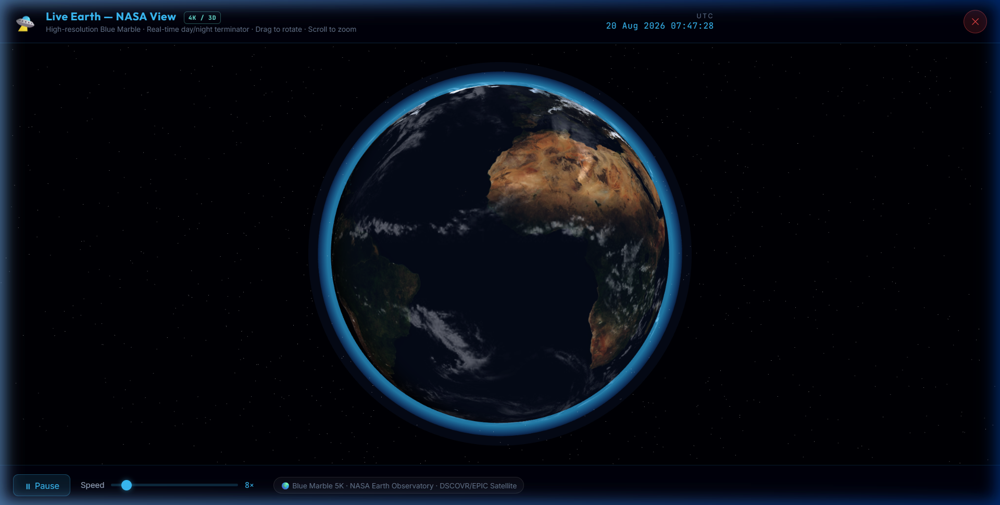

# 🌍 Earth Map Navigator

> A **full-featured interactive map navigator** powered by the **Google Maps JavaScript API** — built with React + Vite. Search anywhere on Earth, get real turn-by-turn directions, toggle live traffic & transit layers, explore landmarks with photo galleries, and export routes as `.gpx` files.

<p align="center">
  
</p>

---

## ✨ Features

### 🗺️ Real Google Maps Integration
- **4 map types**: Dark Road, Satellite, Hybrid, Terrain — powered by Google Maps tiles
- **45° 3D Tilt** mode — native Google Maps perspective tilt
- **Dark custom styling** for the roadmap view
- **Smooth pan & zoom** via Google Maps controls

### 🚦 Live Overlay Layers
| Layer | Description |
|---|---|
| 🚦 **Traffic** | Real-time Google traffic congestion (green / orange / red roads) |
| 🚇 **Transit** | Google transit network — bus routes, metro lines, rail |

<p align="center">
  
  
</p>

### 🛰️ Satellite & 3D View
Switch between satellite imagery and 3D tilt perspective:

<p align="center">
  
  
</p>

### 🧭 Real Turn-by-Turn Directions
Powered by the **Google Directions API** — get actual road-network routing:
- **4 travel modes**: Driving 🚗, Transit 🚆, Walking 🚶, Cycling 🚴
- **Real distance & duration** (e.g. London → Paris: 463 km · 5 hrs 48 mins)
- **Step-by-step instructions** with per-step distance and time
- **GPX export** — download your route as a `.gpx` file for GPS devices

<p align="center">
  
  
</p>

### 📍 Place Explorer & Inspector
- **14 iconic global landmarks** pre-loaded: Eiffel Tower, Taj Mahal, Machu Picchu, Burj Khalifa, Mt. Everest, and more
- **Category filters**: Landmarks, Tech Hubs, Nature, Airports
- **Place Inspector drawer** with photo gallery carousel, elevation, local timezone, weather, and nearby POIs
- **Bookmark** your favourite places for quick access
- **Custom pin dropper** — right-click anywhere on Earth to drop a pin and get GPS coordinates

<p align="center">
  
</p>

### 🔍 Google Places Search
Type any location on Earth in the search bar and press **Enter** or click 🔍 — powered by **Google Places textSearch API** to fly the map to any address, city, or landmark globally.

### 📐 Distance Measurement Tool
Click **📏 Measure** in the controls panel, then click two or more points on the map to draw a geodesic measurement line.

### 🌍 Live Earth Globe (3D WebGL)
View the Earth rotating in real-time space with high fidelity textures:
- **WebGL Rendering**: Renders a 3D Earth sphere with custom shaders for the day/night terminator.
- **NASA Textures**: Uses Earth day mapping, night city lights, and transparent cloud layers.
- **HUD & Stats**: Displays live UTC clock, rotation speed control, and NASA EPIC (DSCOVR) latest photo feeds.

<p align="center">
  
</p>

### 📍 Live Location (GPS Tracking)
- Real-time geolocation support that drops a blue pulsing dot indicating your exact location.
- Fly and auto-focus features that align the camera view directly above you.

### 🌓 Theme Switcher (Light & Dark Modes)
- Seamless swap between a cyber dark tech UI and a clean daylight mode.
- High-contrast visual options with matching maps configurations and font alignment.

---

## 🖥️ Tech Stack

| Layer | Technology |
|---|---|
| **Frontend framework** | React 18 + Vite 8 |
| **Maps** | Google Maps JavaScript API (`@react-google-maps/api`) |
| **Routing** | Google Directions API |
| **Search** | Google Places API (textSearch) |
| **Styling** | Vanilla CSS (glassmorphic dark design system) |
| **Icons & fonts** | Google Fonts — Inter, Outfit, JetBrains Mono |

---

## 🚀 Getting Started

### Prerequisites
- **Node.js** ≥ 18
- A **Google Maps API Key** with these APIs enabled:
  - Maps JavaScript API
  - Places API
  - Directions API
  - Geocoding API

### 1. Clone the repo
```bash
git clone https://github.com/Gaurav-Mishra00/research-map-navigator.git
cd research-map-navigator/frontend
```

### 2. Install dependencies
```bash
npm install
```

### 3. Set your Google Maps API Key
Create a `.env` file in the `frontend/` directory:
```env
VITE_GOOGLE_MAPS_API_KEY=YOUR_API_KEY_HERE
```

> 💡 Get a free key at [console.cloud.google.com](https://console.cloud.google.com). Google gives **$200/month free credit** (~28,000 map loads free per month).

### 4. Run the dev server
```bash
npm run dev
```
Open [http://localhost:5173](http://localhost:5173) in your browser.

### 5. Build for production
```bash
npm run build
```

---

## 📁 Project Structure

```
frontend/
├── src/
│   ├── components/
│   │   ├── GoogleMapView.jsx        # Core Google Maps canvas
│   │   ├── MapHeader.jsx            # Search bar + category filters
│   │   ├── MapControls.jsx          # Zoom, tilt, layers, overlays
│   │   ├── PlaceInspectorDrawer.jsx # Place details, photos, POIs
│   │   ├── RouteNavigatorDrawer.jsx # Directions + real routing
│   │   ├── BookmarksDrawer.jsx      # Saved places
│   │   └── DirectoryGridView.jsx   # Card grid of all places
│   ├── services/
│   │   ├── earthPlacesData.js       # 14 global landmark datasets
│   │   └── mapStyles.js             # Map tile style configs
│   ├── styles/
│   │   ├── index.css                # Design system tokens + global
│   │   └── App.css                  # Component-level styles
│   ├── App.jsx                      # Root state + Google Maps setup
│   └── main.jsx                     # React entry point
├── .env                             # VITE_GOOGLE_MAPS_API_KEY (gitignored)
├── index.html
└── package.json
```

---

## 🗺️ How to Use

| Action | How |
|---|---|
| **Search any place on Earth** | Type in search bar → press `Enter` or click 🔍 |
| **Get directions** | Click `🧭 Directions` → choose origin & destination → click `Get Google Directions` |
| **Switch map type** | Click the layers button → choose Satellite / Hybrid / Terrain |
| **Toggle traffic** | Click `🚦 Traffic` in controls |
| **Toggle transit** | Click `🚇 Transit` in controls |
| **Enable 3D tilt** | Click `📐` in controls |
| **Drop a custom pin** | **Right-click** anywhere on the map |
| **Inspect a landmark** | Click any glowing marker on the map |
| **Bookmark a place** | Open Place Inspector → click bookmark icon |
| **Export route as GPX** | After calculating directions → click `💾 GPX` |
| **Measure distance** | Click `📏 Measure` → click points on the map |

---

## 🔑 API Key Security

> ⚠️ **Never commit your `.env` file.** The `.gitignore` already excludes it.

For production deployments, restrict your key in [Google Cloud Console](https://console.cloud.google.com/apis/credentials):
- **HTTP referrers**: Add your production domain
- **API restrictions**: Limit to Maps JavaScript API, Places API, Directions API only

---

## 📄 License

MIT — see [LICENSE](LICENSE) for details.

---

<p align="center">
  Built with ❤️ using React + Google Maps JavaScript API
</p>


## Local services and release checks

The frontend can run independently with Google Maps, while the optional Navigator route optimizer is provided by the FastAPI backend.

### Frontend configuration

Copy `frontend/.env.example` to `frontend/.env.local` and set a browser-restricted `VITE_GOOGLE_MAPS_API_KEY`. Do not commit `.env.local` or share the key in source control. `VITE_ROUTE_API_URL` defaults to `http://localhost:8000` and can be changed when the backend is deployed elsewhere.

```bash
cd frontend
cp .env.example .env.local
npm install
npm run dev -- --host
```

### Backend optimizer

```bash
cd backend
python3 -m uvicorn app.main:app --reload --port 8000
```

The backend exposes `GET /health`, `POST /route`, and `POST /optimize-route`. The route drawer's **Optimize with Navigator API** action uses `/optimize-route`; Google Directions remains the map-rendering provider for turn-by-turn geometry.

### Validation

Run the release checks from the repository root:

```bash
python3 -m unittest discover -s backend/test -p 'test_*.py'
cd frontend && npm run build && npm run lint
```
