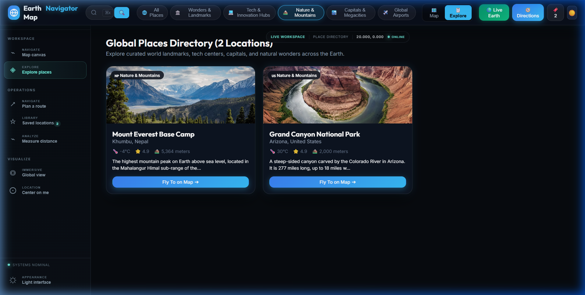

# 🌍 ResearchMap Navigator

> A **full-featured geospatial command center and interactive map navigator** powered by the **Google Maps JavaScript API**, **3D WebGL Live Earth Globe**, and **FastAPI Route Optimization Service**. Search anywhere on Earth, get real turn-by-turn directions, optimize multi-stop itineraries, toggle live traffic & transit layers, explore global landmarks with rich photo galleries, and export routes as `.gpx` files.

<p align="center">
  
</p>

---

## ✨ Key Features

### 🗺️ Google Maps Integration & Cyber Theme
- **4 Map Types**: Dark Road, Satellite, Hybrid, and Terrain — powered by Google Maps tiles.
- **45° 3D Tilt Mode**: Native Google Maps perspective tilt.
- **Dark Custom Styling**: High-contrast, glassmorphic UI system.
- **Smooth Pan, Zoom & Camera Reset**: Complete spatial navigation controls.

### 🚦 Live Overlays & Traffic Intelligence
| Layer | Description |
|---|---|
| 🚦 **Traffic Layer** | Real-time traffic flow & congestion overlays (green / orange / red roads) |
| 🚇 **Transit Network** | Google transit map layers — subways, commuter rail, and bus routes |

<p align="center">
  
  
</p>

---

### 🛰️ Satellite & 3D Perspective Tilt
Switch seamlessly between high-resolution satellite imagery and 45° 3D tilt perspective:

<p align="center">
  
  
</p>

---

### 🧭 Route Planning, Navigation & Backend Optimizer
Powered by **Google Directions API** and the **FastAPI Navigator Route Optimizer**:
- **4 Travel Profiles**: Driving 🚗, Transit 🚆, Walking 🚶, Cycling 🚴
- **Real Distance & Duration Metrics**: Accurate road geometry and time calculations.
- **Turn-by-Turn Step Guidance**: Detailed step breakdown with distance markers.
- **Navigator Route Optimizer API**: Multi-waypoint sequence optimization via backend heuristics.
- **GPX Export**: Download route tracks as `.gpx` files ready for GPS devices and smartwatches.

<p align="center">
  
  
</p>

---

### 📍 Place Inspector & Curated Explore Grid
- **Global Landmarks & POIs**: Pre-loaded landmarks across Wonders, Tech Hubs, Nature, and Airports.
- **Place Inspector Drawer**: High-definition photo carousel, elevation, timezone, live weather, and nearby points of interest.
- **Explore Grid View**: Card grid catalog of iconic destinations worldwide.
- **Bookmarks Library**: Save and manage favourite destinations locally.
- **Custom Coordinate Pin Dropper**: Right-click anywhere on the map to pin exact GPS coordinates.

<p align="center">
  
  
</p>

---

### 🌍 3D WebGL Live Earth Globe
- **Interactive 3D Globe**: Built with Three.js WebGL and custom day/night shaders.
- **NASA Textures & Atmosphere**: High-resolution 5K Earth day maps, nighttime city lights, and animated cloud layers.
- **HUD & Telemetry**: Live UTC clock, rotation speed control, and NASA EPIC DSCOVR photo integration.

<p align="center">
  
</p>

---

## 🖥️ Tech Stack

| Layer | Technology |
|---|---|
| **Frontend Framework** | React 19 + Vite 8 |
| **3D Rendering** | Three.js WebGL (Custom Shaders) |
| **Maps & Places** | `@react-google-maps/api` (Maps, Places, Directions, Geometry) |
| **HTTP Client** | Axios (with caching & debounce) |
| **Design System** | Glassmorphic Dark/Light CSS Tokens (`Inter`, `Outfit`, `JetBrains Mono`) |
| **Backend Service** | Python 3.13 + FastAPI + Uvicorn |
| **Testing** | Pytest (Backend API & Algorithms) + Vite Build Validation |

---

## 📁 Project Structure

```
ResearchMap-Navigator/
├── backend/
│   ├── app/
│   │   ├── algorithms/          # Route optimization algorithms & heuristics
│   │   ├── services/            # Routing service integrations
│   │   └── main.py              # FastAPI app routes (/health, /route, /optimize-route)
│   ├── test/
│   │   ├── test_algorithms.py   # Unit tests for routing optimizer
│   │   ├── test_api.py          # FastAPI endpoint integration tests
│   │   ├── test_dijkstra.py     # Graph algorithm tests
│   │   └── test_graph.py        # Graph data structure tests
│   └── requirements.txt         # FastAPI, Uvicorn, Pydantic, HTTPX
├── frontend/
│   ├── public/
│   │   └── textures/            # NASA Earth Day/Night 5K textures
│   ├── src/
│   │   ├── api/
│   │   │   └── client.js        # Axios API client with route caching & debounce
│   │   ├── components/
│   │   │   ├── CommandSidebar.jsx       # Command navigation sidebar
│   │   │   ├── GoogleMapView.jsx        # Google Maps canvas & tile renderer
│   │   │   ├── LiveEarthView.jsx        # 3D WebGL Earth globe
│   │   │   ├── MapHeader.jsx            # Search bar, category filters & actions
│   │   │   ├── MapControls.jsx          # Floating zoom, layers, 3D tilt, measure
│   │   │   ├── PlaceInspectorDrawer.jsx # Landmark details, photo carousel, weather
│   │   │   ├── RouteNavigatorDrawer.jsx # Turn-by-turn directions & route optimizer
│   │   │   ├── BookmarksDrawer.jsx      # Saved destinations drawer
│   │   │   ├── DirectoryGridView.jsx   # Explore places grid view
│   │   │   └── ErrorBoundary.jsx        # React component error boundary
│   │   ├── services/
│   │   │   ├── earthPlacesData.js       # Global landmarks & place datasets
│   │   │   └── mapStyles.js             # Google Maps dark tile styles
│   │   ├── styles/
│   │   │   ├── index.css                # Design system tokens & global styling
│   │   │   └── App.css                  # Glassmorphic component styles
│   │   ├── App.jsx                      # App root state & Google Maps loader
│   │   └── main.jsx                     # React entry point
│   ├── .env                             # Frontend environment config (API Key)
│   ├── .env.example                     # Environment template
│   └── package.json
└── assets/
    └── screenshots/                     # Documentation preview images
```

---

## 🚀 Quick Start Guide

### Prerequisites
- **Node.js** ≥ 18
- **Python** ≥ 3.10
- **Google Maps API Key** with the following APIs enabled:
  - Maps JavaScript API
  - Places API
  - Directions API
  - Geocoding API

---

### 1. Backend Setup (FastAPI Route Optimizer)

```bash
# Navigate to backend
cd backend

# Install dependencies
pip install -r requirements.txt

# Start backend server
python -m uvicorn app.main:app --reload --port 8000
```
> The API will be live at `http://localhost:8000` (API Docs: `http://localhost:8000/docs`).

---

### 2. Frontend Setup (React + Vite)

```bash
# Navigate to frontend
cd frontend

# Install dependencies
npm install

# Configure environment
cp .env.example .env
```

Edit `frontend/.env` and add your Google Maps API Key:
```env
VITE_GOOGLE_MAPS_API_KEY=YOUR_GOOGLE_MAPS_API_KEY
VITE_ROUTE_API_URL=http://localhost:8000
```

Start the frontend development server:
```bash
npm run dev
```
> Open **[http://localhost:5173](http://localhost:5173)** in your browser.

---

## 🧪 Testing & Validation

Run the test suite and validation checks:

```powershell
# Run Backend Test Suite (Pytest)
python -m pytest backend/test

# Run Frontend Production Build & Bundle Check
cd frontend
npm run build
```

---

## 🗺️ Keyboard & Action Guide

| Action | Shortcut / Method |
|---|---|
| **Search Location** | Focus search bar & press `Enter` or click 🔍 |
| **Command Search** | Press `⌘K` or `Ctrl + K` |
| **Plan Route** | Click `🧭 Directions` in the header or sidebar |
| **Switch Map Type** | Click layers button &rarr; choose *Satellite*, *Hybrid*, *Terrain*, or *Dark Road* |
| **Live Traffic** | Click `🚦 Traffic` in floating controls |
| **Transit Network** | Click `🚇 Transit` in floating controls |
| **45° 3D Tilt** | Click `📐` in floating controls |
| **Drop GPS Pin** | **Right-click** anywhere on the map |
| **Measure Distance** | Click `📏 Measure` &rarr; click 2+ points on the map |
| **3D Live Earth** | Click `🌍 Live Earth` in the header |
| **Export Route** | After computing a route, click `💾 GPX` |

---

## 🔑 API Security Notice
Never commit `.env` or expose private API keys in version control. Configure **HTTP Referrer Restrictions** in the [Google Cloud Console](https://console.cloud.google.com/apis/credentials) for production deployments (`https://yourdomain.com/*`). For local development, authorize:
- `http://localhost:5173/*`
- `http://127.0.0.1:5173/*`

---

## 📄 License
MIT © Gaurav Mishra
